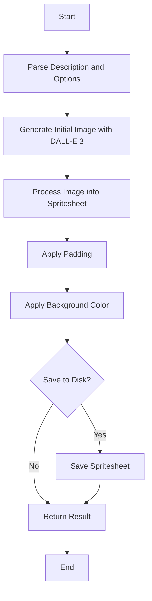
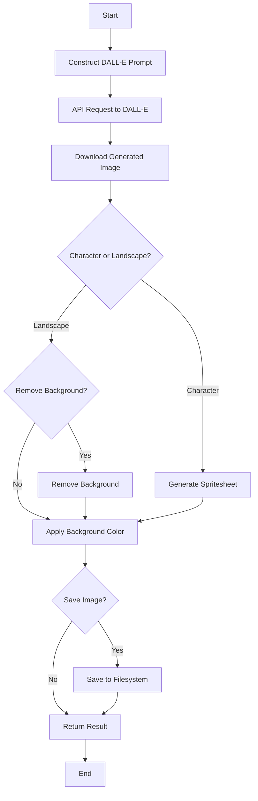

# generateCharacterSpritesheet

Generates a pixel art character spritesheet with multiple animation states.

## Function Signature

```javascript
async function generateCharacterSpritesheet(description, options = {})
```

## Parameters

- `description` (string): A description of the character to generate.
- `options` (object, optional): Configuration options for the spritesheet generation.

## Options

| Option | Type | Default | Description |
|--------|------|---------|-------------|
| states | string[] | ['idle', 'walk', 'run', 'attack'] | Animation states to generate |
| framesPerState | number | 6 | Number of frames per animation state |
| size | string | '1024x1024' | Output image size |
| style | string | 'pixel-art' | Art style to use |
| padding | number | 1 | Padding between sprites |
| direction | string | 'right' | Base direction the character faces |
| save | boolean | false | Whether to save the generated spritesheet to disk |
| backgroundColor | string | 'transparent' | Background color of the spritesheet |

## Process Flow



## Return Value

The function returns a Promise that resolves to an object with the following properties:

- `original` (string): URL of the original generated image
- `spritesheet` (string): Base64-encoded PNG data URI of the processed spritesheet
- `metadata` (object): Metadata about the generated spritesheet
  - `states` (string[]): List of animation states
  - `framesPerState` (number): Number of frames per state
  - `totalFrames` (number): Total number of frames in the spritesheet
  - `dimensions` (object): Width and height of the spritesheet
  - `frameData` (object): Information about each animation state's frames
  - `backgroundColor` (string): Background color of the spritesheet

## Examples

### Basic Usage

```javascript
import { generateCharacterSpritesheet } from 'spriteAI';

const result = await generateCharacterSpritesheet('a cute robot');
console.log(result.spritesheet); // Base64 encoded spritesheet
console.log(result.metadata); // Metadata about the spritesheet
```

### Custom Animation States

```javascript
const result = await generateCharacterSpritesheet('a fierce dragon', {
  states: ['idle', 'fly', 'breathe-fire', 'roar'],
  framesPerState: 8
});
```

### Saving to Disk with Custom Background

```javascript
await generateCharacterSpritesheet('a ninja warrior', {
  save: true,
  size: '2048x2048',
  backgroundColor: '#FF00FF' // Magenta background
});
// Saves to ./assets/ninja_warrior_spritesheet.png
```

## Notes

- The function uses DALL-E 3 to generate the initial spritesheet image.
- The generated spritesheet is organized with each row representing a different animation state.
- When `save` is true, the spritesheet is saved in the `assets` folder of the current working directory.
- The function automatically processes the generated image to create a properly formatted spritesheet with the specified number of frames and states.
- The `backgroundColor` option allows for customization of the spritesheet background. It can be set to 'transparent' or any valid CSS color value.

# Image Processing Pipeline

This page describes the image processing pipeline used in the SpriteAI project, from initial API request through final sprite generation and optional background removal.

## Overview

The pipeline consists of the following main steps:

1. API Request to DALL-E
2. Image Download 
3. Spritesheet Generation
4. Background Removal (Optional)
5. Background Color Application
6. Image Saving (Optional)

## Pipeline Flow



## Detailed Pipeline

### 1. API Request to DALL-E

The process begins with constructing a detailed prompt describing the desired character or landscape sprite. This prompt is sent to OpenAI's DALL-E 3 model via API request:

```javascript
const openAiObject = new OpenAI();
const response = await openAiObject.images.generate({
  model: "dall-e-3",
  prompt: prompt,
  size: size,
  n: 1
});
```

### 2. Image Download

Once DALL-E generates the image, it's downloaded using axios:

```javascript
const res = await axios.get(response.data[0].url, { responseType: 'arraybuffer' });
const imgBuffer = Buffer.from(res.data);
```

### 3. Spritesheet Generation 

For character spritesheets, the downloaded image is processed to create an organized spritesheet with proper padding between sprites:

```javascript
const spritesheet = await generateSpritesheet(imgBuffer, {
  rows: states.length,
  framesPerRow: framesPerState,
  padding: padding
});
```

### 4. Background Removal (Optional)

For landscape sprites, there's an option to remove the background:

```javascript
if (options.removeBackground) {
  // Process involves:
  // 1. Writing image to temporary file
  // 2. Removing background color
  // 3. Reading processed image back
  // 4. Cleaning up temporary files
}
```

The background removal uses the Jimp library to replace pixels matching a target color (typically white) with transparency.

### 5. Background Color Application

Apply the specified background color to the spritesheet or landscape image:

```javascript
const backgroundColor = options.backgroundColor || 'transparent';
const imageWithBackground = await applyBackgroundColor(processedImage, backgroundColor);
```

### 6. Image Saving (Optional)

If requested, the final processed image can be saved to the local filesystem:

```javascript
if (options.save) {
  const filename = path.join(assetsDir, `${description.replace(/\s+/g, '_')}_landscape.png`);
  await sharp(imageWithBackground).toFile(filename);
}
```

## Output

The pipeline returns an object containing:

- URL of the original DALL-E generated image
- Base64 encoded processed image (spritesheet or landscape)
- Metadata about the generated sprite, including dimensions, animation states (for characters), background color, and other relevant details

This processed image data can then be used directly in game development or further asset creation workflows.
