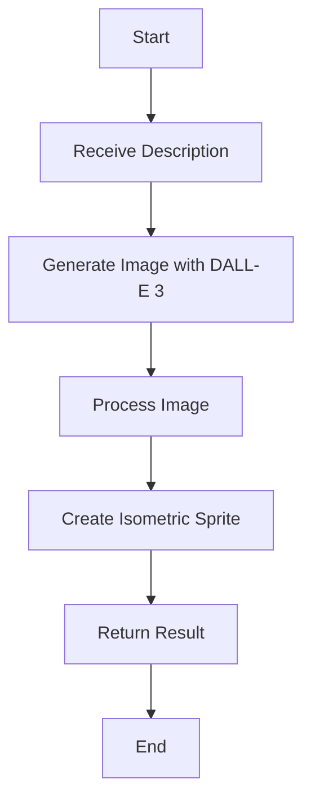
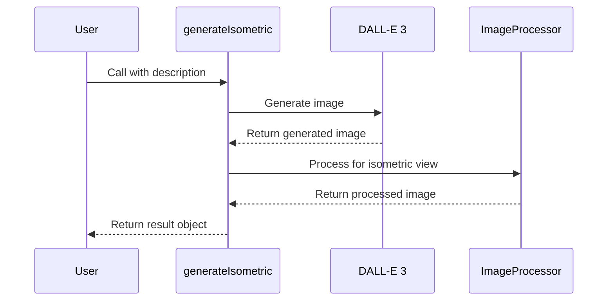
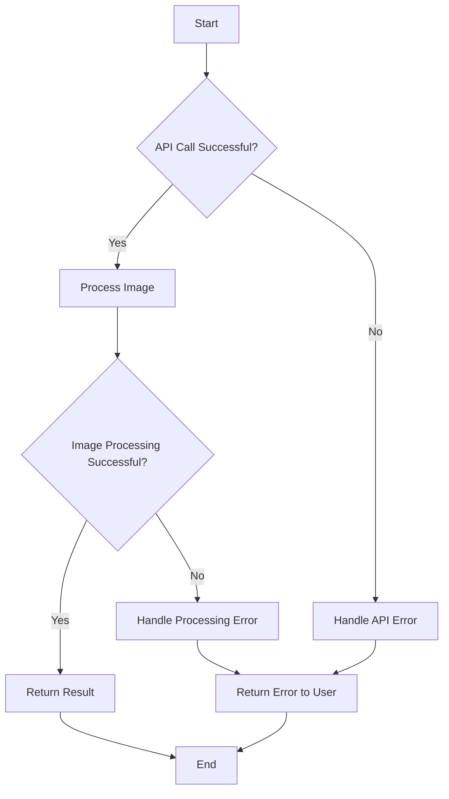

# generateIsometric Documentation

## Brief Summary

`generateIsometric` is a function that generates an isometric sprite image based on a given description, using AI-powered image generation and analysis.

## Process Flow



## Usage

To use `generateIsometric`, import it from the sprite module and call it with a description of the object or character you want to generate in isometric style.

```javascript
import { sprite } from './path/to/sprite/module';

const result = await sprite.generateIsometric(description, options);
```

## Parameters

* `description` (string, required): A text description of the object or character to generate in isometric style.

* `options` (object, optional):

  * `save` (boolean): Whether to save the generated image to disk.

  * Other options may be available (refer to the options in generateSprite for potential additional parameters).

## Return Value

Returns an object containing:

* `image`: Base64-encoded image data URL of the generated isometric sprite.

* `url`: Direct URL to the generated image.

## Function Flow



## Examples

1. Generate an isometric sprite:

```javascript
const result = await sprite.generateIsometric("A medieval castle");
console.log(result.image); // Base64-encoded image data URL
console.log(result.url); // Direct URL to the image
```

2. Generate and save an isometric sprite:

```javascript
const result = await sprite.generateIsometric("A futuristic spaceship", { save: true });
console.log("Image saved and accessible at:", result.url);
```

## Notes or Considerations

* The function uses AI models (DALL-E 3) to generate images, which may result in varying outputs for the same input.

* Generated sprites are optimized for isometric game graphics, viewed from a top-down 3/4 perspective.

* The function generates a single frame, suitable for static isometric objects or characters.

* When saving images, they are stored with a timestamp-based filename.

* The function may take some time to complete due to API calls and image processing.

* Ensure you have the necessary API credentials and permissions set up to use the OpenAI image generation service.

* The function is designed to work with various types of objects and characters, but complex or highly detailed descriptions may lead to less accurate results.

* Consider using simple, clear descriptions for best results in generating isometric sprites.

## Error Handling



## Performance Considerations

* The function's performance depends on the response time of the DALL-E 3 API and the complexity of the image processing required.

* For applications requiring multiple sprites, consider implementing a caching mechanism to store and reuse previously generated sprites when appropriate.

* If you need to generate a large number of sprites, consider implementing a queue system to manage API rate limits and prevent overloading the service.

## Best Practices

* Use concise and specific descriptions to get the most accurate results.

* Implement error handling in your code to gracefully manage potential issues with the API or image processing.

* Consider implementing a retry mechanism for handling temporary API failures or network issues.

* Regularly update your API credentials and stay informed about any changes or updates to the DALL-E 3 API that may affect the function's performance.

## Limitations

* The quality and accuracy of the generated sprites depend on the capabilities of the DALL-E 3 model and may not always meet specific design requirements.

* The function is primarily designed for generating static isometric sprites and may not be suitable for creating animated or highly detailed game assets.

* There may be limitations on the number of API calls you can make within a given time period, depending on your OpenAI account type and usage limits.

## Future Improvements

* Integration with other AI image generation models to provide alternative options or improved results.

* Adding support for generating sprite sheets or simple animations.

* Implementing more advanced image processing techniques to further enhance the isometric perspective of generated sprites.

* Developing a user interface or command-line tool for easier sprite generation and management.
