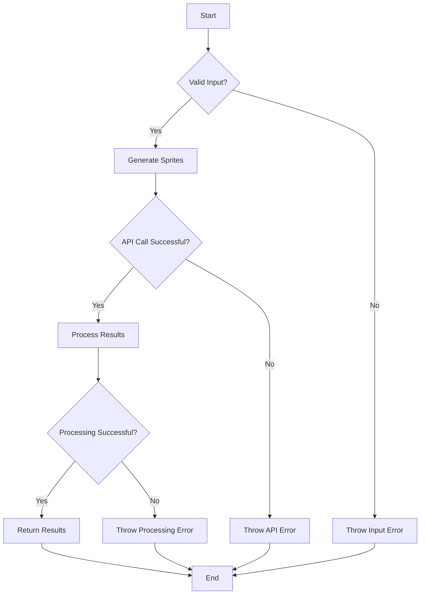

# generateItemSprites

Generates pixel art item sprites for use in games or other applications.

## Function Signature

```javascript
async function generateItemSprites(description, options = {})
```

## Parameters

- `description` (string): A description of the item or set of items to generate.
- `options` (object, optional): Configuration options for the sprite generation.

## Options

| Option | Type | Default | Description |
|--------|------|---------|-------------|
| count | number | 1 | Number of item sprites to generate |
| size | string | '1024x1024' | Output image size |
| style | string | 'pixel-art' | Art style to use |
| background | string | 'transparent' | Background style ('transparent' or 'white') |
| save | boolean | false | Whether to save the generated sprites to disk |

## Process Flow

```mermaid
graph TD
    A[Start] --> B[Parse Description and Options]
    B --> C[Generate DALL-E Prompt]
    C --> D[Call DALL-E API]
    D --> E[Download Generated Image]
    E --> F[Process Image]
    F --> G{Multiple Items?}
    G -->|Yes| H[Split Into Individual Sprites]
    G -->|No| I[Prepare Single Sprite]
    H --> J{Save to Disk?}
    I --> J
    J -->|Yes| K[Save Sprite(s)]
    J -->|No| L[Prepare Result Object]
    K --> L
    L --> M[Return Result]
    M --> N[End]
```

## Return Value

The function returns a Promise that resolves to an object with the following properties:

- `original` (string): URL of the original generated image
- `sprites` (array): An array of objects, each containing:
  - `image` (string): Base64-encoded PNG data URI of the processed sprite
  - `metadata` (object): Metadata about the generated sprite
    - `dimensions` (object): Width and height of the sprite
    - `filename` (string): Filename of the saved sprite (if save option was true)

## Examples

### Basic Usage

```javascript
import { generateItemSprites } from 'spriteAI';

const result = await generateItemSprites('a magical sword');
console.log(result.sprites[0].image); // Base64 encoded sprite
console.log(result.sprites[0].metadata); // Metadata about the sprite
```

### Generating Multiple Items

```javascript
const result = await generateItemSprites('potion bottles: health, mana, and strength', {
  count: 3,
  size: '512x512'
});

result.sprites.forEach((sprite, index) => {
  console.log(`Sprite ${index + 1}:`, sprite.image);
});
```

### Saving to Disk

```javascript
await generateItemSprites('a set of gemstones: ruby, emerald, sapphire, diamond', {
  count: 4,
  save: true
});
// Saves to ./assets/gemstone_1.png, gemstone_2.png, etc.
```

## Notes

- The function uses DALL-E 3 to generate the initial item sprite image(s).
- When generating multiple items, the function attempts to intelligently split the generated image into individual sprites.
- The 'pixel-art' style is used by default to create retro-style game assets.
- When `save` is true, the sprite(s) are saved in the `assets` folder of the current working directory.
- The function automatically processes the generated image to create properly formatted sprites with transparent backgrounds (unless 'white' background is specified).

## Error Handling



The function includes error handling for various scenarios:

- Invalid input parameters will result in an `InputError`
- Failed API calls to DALL-E will throw an `APIError`
- Issues during image processing will result in a `ProcessingError`

It's recommended to wrap calls to `generateItemSprites` in a try-catch block to handle these potential errors gracefully in your application.