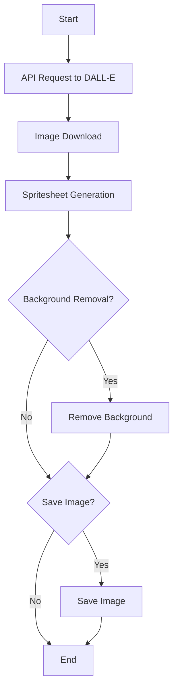
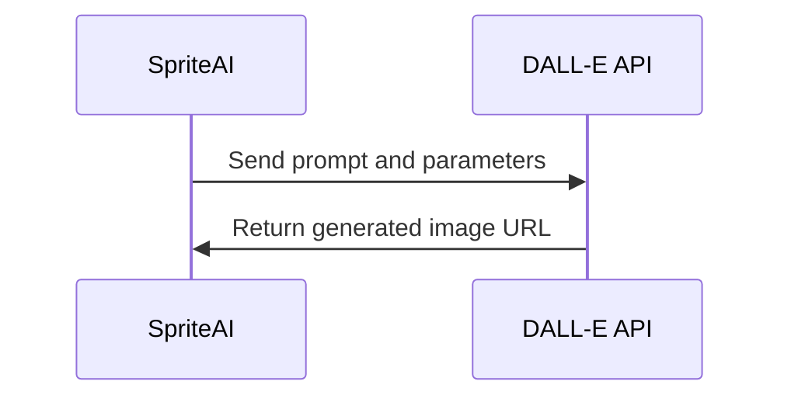
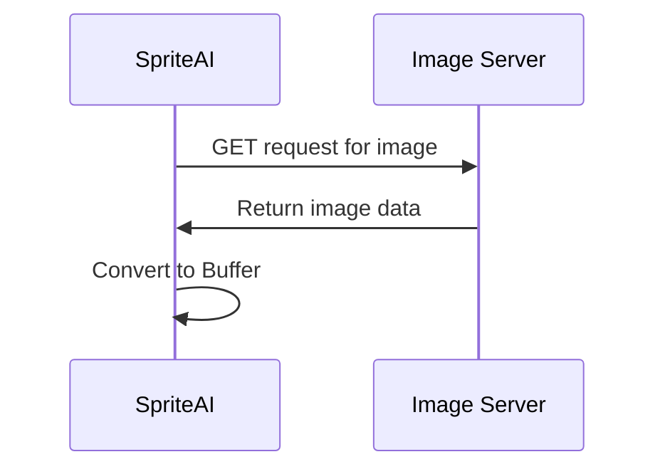
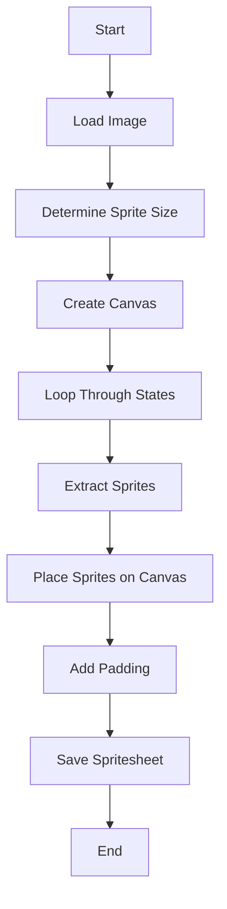
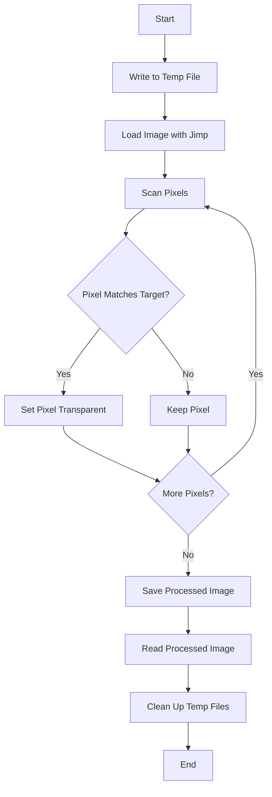
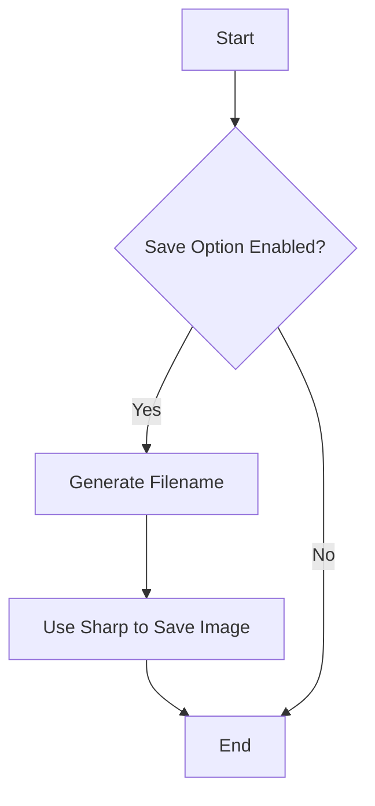
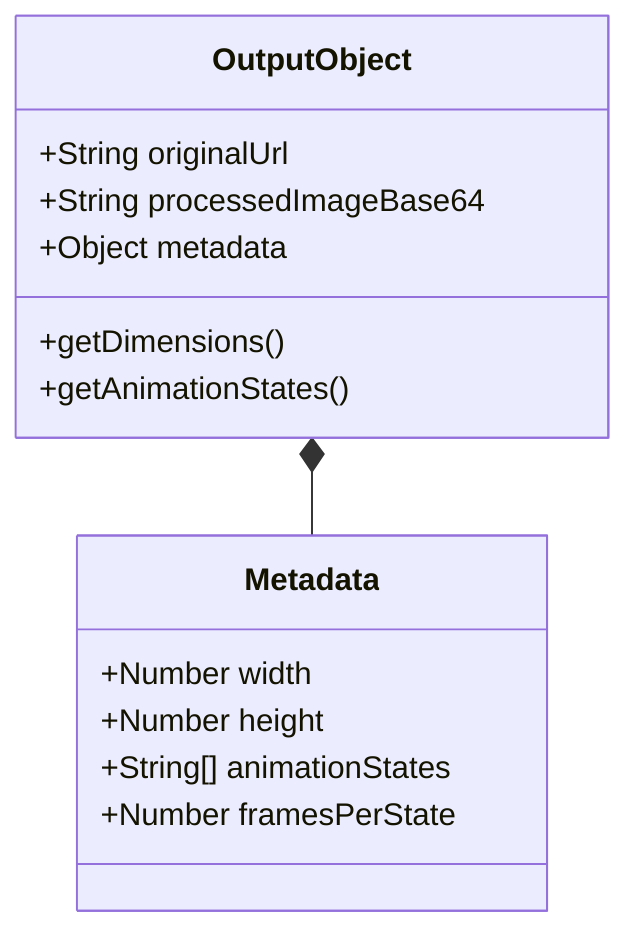

# Image Processing Pipeline

This page describes the image processing pipeline used in the SpriteAI project, from initial API request through final sprite generation and optional background removal.

## Overview

The pipeline consists of the following main steps:

1. API Request to DALL-E
2. Image Download 
3. Spritesheet Generation
4. Background Removal (Optional)
5. Image Saving (Optional)



## Detailed Pipeline

### 1. API Request to DALL-E

The process begins with constructing a detailed prompt describing the desired character or landscape sprite. This prompt is sent to OpenAI's DALL-E 3 model via API request:

```javascript
const openAiObject = new OpenAI();
const response = await openAiObject.images.generate({
  model: "dall-e-3",
  prompt: prompt,
  size: size,
  n: 1
});
```



### 2. Image Download

Once DALL-E generates the image, it's downloaded using axios:

```javascript
const res = await axios.get(response.data[0].url, { responseType: 'arraybuffer' });
const imgBuffer = Buffer.from(res.data);
```



### 3. Spritesheet Generation 

For character spritesheets, the downloaded image is processed to create an organized spritesheet with proper padding between sprites:

```javascript
const spritesheet = await generateSpritesheet(imgBuffer, {
  rows: states.length,
  framesPerState: framesPerState,
  padding: padding
});
```



### 4. Background Removal (Optional)

For landscape sprites, there's an option to remove the background:

```javascript
if (options.removeBackground) {
  // Process involves:
  // 1. Writing image to temporary file
  // 2. Removing background color
  // 3. Reading processed image back
  // 4. Cleaning up temporary files
}
```

The background removal uses the Jimp library to replace pixels matching a target color (typically white) with transparency.



### 5. Image Saving (Optional)

If requested, the final processed image can be saved to the local filesystem:

```javascript
if (options.save) {
  const filename = path.join(assetsDir, `${description.replace(/\s+/g, '_')}_landscape.png`);
  await sharp(imgBuffer).toFile(filename);
}
```



## Output

The pipeline returns an object containing:

- URL of the original DALL-E generated image
- Base64 encoded processed image (spritesheet or landscape)
- Metadata about the generated sprite, including dimensions, animation states (for characters), and other relevant details

This processed image data can then be used directly in game development or further asset creation workflows.



## Error Handling

The pipeline includes robust error handling to manage potential issues during the image generation and processing stages:

- API Request Errors: If the DALL-E API request fails, the error is caught and logged, allowing for appropriate user feedback or retry mechanisms.
- Image Download Errors: Network issues or invalid image data are handled to prevent pipeline disruption.
- Processing Errors: Errors during spritesheet generation or background removal are caught and reported, ensuring the pipeline can gracefully handle unexpected issues.

```javascript
try {
  // Pipeline steps
} catch (error) {
  console.error('Error in image processing pipeline:', error);
  // Handle error (e.g., return error response, retry, etc.)
}
```

Proper error handling ensures a more robust and user-friendly experience, especially important in a production environment where reliability is key.

## Performance Considerations

To optimize the pipeline's performance:

1. Image caching is implemented to reduce redundant API calls and image processing for frequently requested sprites.
2. Asynchronous processing is used where possible to improve responsiveness.
3. Resource-intensive operations like background removal are optional and can be toggled based on user needs or system capabilities.

These optimizations help balance quality output with efficient resource usage, crucial for maintaining responsiveness in game development workflows.
